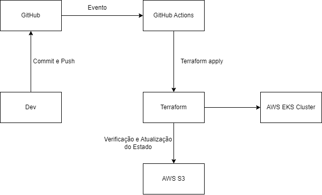

# Automação com Terraform

## Objetivo do projeto

O objetivo é automatizar o processo de criação e manutenção do ambiente para execução dos projetos de Software da Mr. Fusion Solutions.

## Premissas do Projeto

Para o desenvolvimento do projeto, foram levantadas as seguintes premissas:

+ Utilizar o Terraform como ferramenta de infraestrutura como código.
+ O cluster Kubernetes deve ser criado utilizando o serviço Elastic Kubernetes Service (EKS) da AWS.
+ O projeto deve ser o mais simples e reaproveitável possível. 
+ Toda vez que houver alteração no código Terraform na branch main do repositório, a pipeline deve ser executada.
+ Só vai haver um ambiente Kubernetes (os ambientes de desenvolvimento, homologação e produção serão separados por namespace).

## Tecnologias utilizadas no projeto

+ [AWS](https://aws.amazon.com)
   + [S3](https://aws.amazon.com/s3)
   +  [EKS](https://aws.amazon.com/eks)
+ [AWS CLI](https://aws.amazon.com/cli/)
+ [Terraform](https://www.terraform.io)
    + [AWS Provider](https://registry.terraform.io/providers/hashicorp/aws)
    + [AWS VPC Terraform module](https://registry.terraform.io/modules/terraform-aws-modules/vpc/aws)
    + [AWS EKS Terraform module](https://registry.terraform.io/modules/terraform-aws-modules/eks/aws)
+ [GitHub](https://github.com)
    + [GitHub Actions](https://github.com/features/actions)

## Motivações para o uso de cada tecnologia

+ **EKS** - Requisito do projeto.
+ **S3** - Foi adotado para armazenar o estado atual do projeto Terraform. Foi definido o seu uso por ser um serviço da própria AWS e ter controle de versionamento dos arquivos.
+ **GitHub Actions** - Requisito do projeto.

## Instruções para executar

A pipeline de criação ou atualização do projeto é executada sempre que o código Terraform do projeto for alterado na branch main.

## Configurações 
As variáveis de configuração do projeto estão no arquivo terraform.tfvars, exceto as variáveis consideradas sensiveis que estão no gerenciador de secrets do GitHub Actions.

**Variáveis armazendas em secrets:**

AWS_ACCESS_KEY_ID => Access Key utilizada para configurar o AWS CLI.

AWS_SECRET_ACCESS_KEY => Secret access Key utilizada para configurar o AWS CLI.

AWS_BUCKET_NAME => Nome do Bucket utilizado para armazenar o estado do projeto Terraform.

AWS_BUCKET_FILE => Nome do arquivo utilizado para armazenar o estado do projeto Terraform.

## Estrutura da solução

Explicação do Fluxo

## Possíveis evoluções do projeto

Algumas evoluções que sugiro para o projeto:

+ Separar ambientes dev, homolog e prod utilizando o Terraform Workspace ou Terraform Grunt para criação e gerenciamento desses ambientes.
+ Usar o DynamoDB junto com o S3 para evitar execução paralela do Terraform.

...
